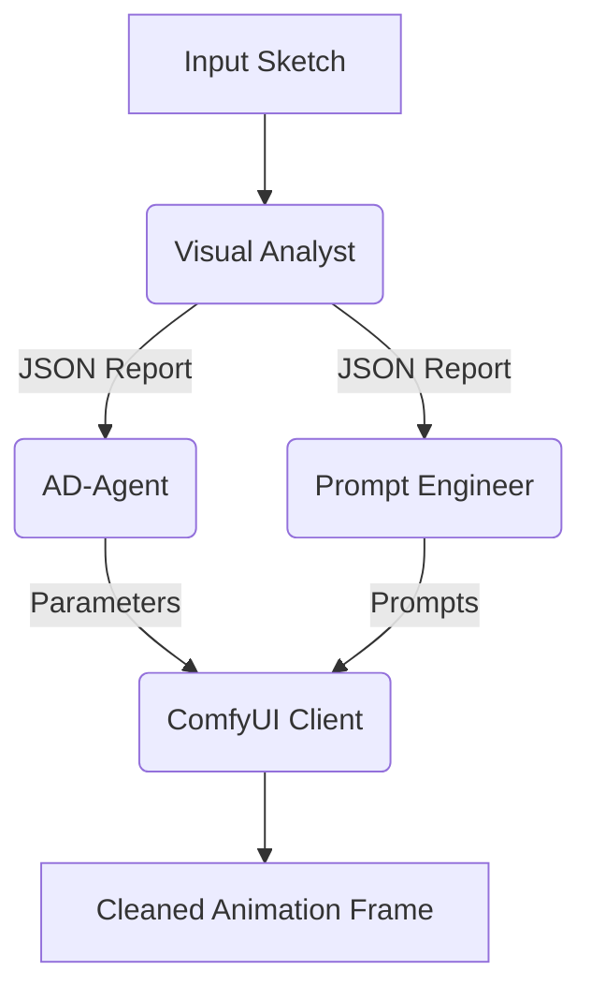

# Plan: Enhance AI Animation System (M3)

I have analyzed the current implementation of the AI Animation Studio (M3). The system is well-structured with a clear pipeline: Visual Analyst → AD-Agent → Prompt Engineer → ComfyUI.

## Proposed Enhancements

### 1. Robust Prompt Parsing in Visual Analyst
The [`run_visual_analyst_m3`](modules/visual_analyst.py:18) function currently uses a simple `json.loads` which might fail if Gemini includes markdown code blocks or extra text.
- **Action**: Implement a more robust JSON extractor that handles markdown code blocks and potential trailing text.

### 2. Parameter Sensitivity Tuning in AD-Agent
The [`create_parameter_plan_m3`](modules/animation_director.py:10) function uses fixed ranges for transitions. 
- **Action**: Add more granularity to the transition matrix, possibly including a "Low Risk" or "Simple" variation for cleaner inputs to avoid over-processing.

### 3. Prompt Engineer Token Management
The [`_cap_prompt_tokens`](modules/prompt_engineer.py:57) function caps at 75 tokens by splitting on commas. This is a naive approach as actual CLIP tokenization is different.
- **Action**: Improve the capping logic to be more aware of emphasis brackets and prioritize key tags (like score tags and subject details) over secondary descriptors.

### 4. Logging and Observability
The current agents use `st.warning` or print for errors.
- **Action**: Introduce a structured logging mechanism to track agent decisions (e.g., why a specific denoise value was chosen) for easier debugging.

## Mermaid Workflow

## Proposed Todo List for Implementation

- [ ] Refactor `modules/visual_analyst.py` to use a robust JSON parser.
- [ ] Update `modules/animation_director.py` with refined rules for "low complexity" inputs.
- [ ] Enhance `modules/prompt_engineer.py` token capping to prioritize subject and score tags.
- [ ] Add structured logging to `modules/utils.py` and integrate it into all agents.
